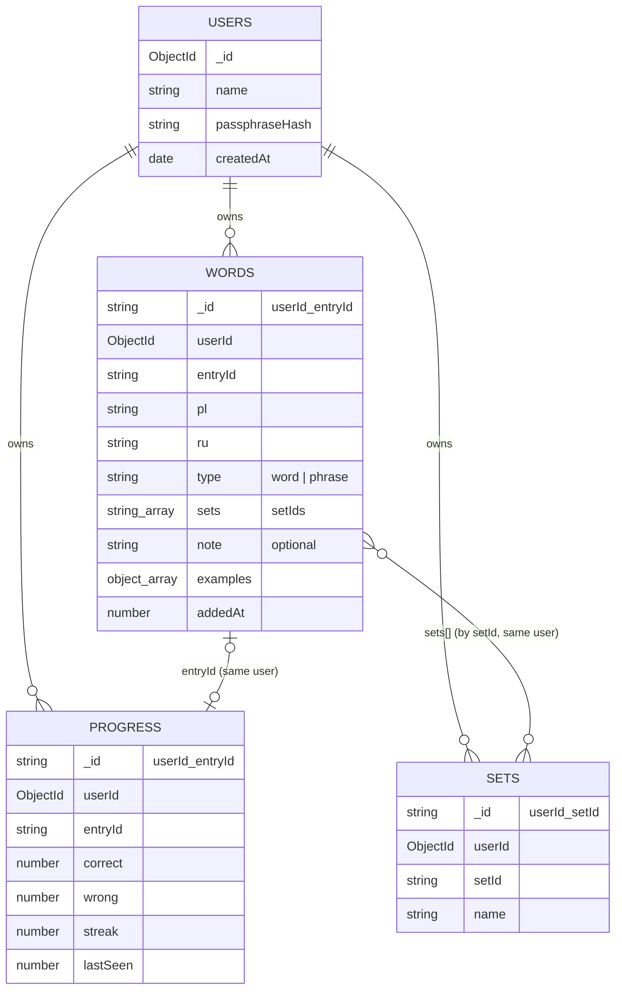

# Collection structure

Four collections in the `polski_trainer` MongoDB Atlas database. Every
collection except `users` is scoped per user and keyed so that a single word,
set, or progress record can be added, edited, or deleted on its own —
never as part of rewriting one giant document.

## Relationships



`words.sets` holds `setId` strings, resolved against that same user's `sets`
collection. `words` and `progress` are linked only "logically," by sharing
`(userId, entryId)` — there is no foreign-key/`$lookup` join in normal
operation; the API reads both collections for a user and matches them by
`entryId` in memory, the same way the old single-file JSON did.

## `users`

```json
{
  "_id": "ObjectId(...)",
  "name": "Duchess",
  "passphraseHash": "<bcrypt hash>",
  "createdAt": "2026-01-01T00:00:00.000Z"
}
```

No self-signup — users are provisioned by hand with `scripts/add-user.ts`.
Login is passphrase-only, with no separate username: `requireAuth` scans
every user in this collection and `bcrypt.compare`s the presented passphrase
against each hash; whichever matches identifies the caller for that request.
This scan is fine at a handful of users (a few `bcrypt.compare` calls per
request) — it would not scale to a public app with thousands of accounts,
but that was never the goal here.

## `words`

```json
{
  "_id": "<userId>_<entryId>",
  "userId": "ObjectId(...)",
  "entryId": "dom",
  "pl": "dom",
  "ru": "дом",
  "type": "word",
  "sets": ["mieszkanie"],
  "note": "optional",
  "examples": [
    { "pl": "To jest mój dom.", "ru": "Это мой дом.", "source": "file" }
  ],
  "addedAt": 1737000000000
}
```

One document per vocabulary entry, **not** one blob per user. With up to
~10k words per user, this is the whole point of using a real database
instead of the old single JSON file: a single word is read, edited, or
deleted as one document, never by rewriting the entire vocabulary.

- `_id` is `userId_entryId` so a single-word lookup or upsert is a direct
  primary-key operation, not a scan.
- `entryId` is exactly the frontend's own stable slug id, carried through
  unchanged — the API never invents its own id scheme, respecting the
  frontend's "id/slug is never recomputed" invariant (see the frontend's
  `AGENTS.md`).
- Indexed on `{ userId: 1 }` (list-all-my-words queries) and uniquely on
  `{ userId: 1, entryId: 1 }` (prevents duplicates, backs `bulkWrite`
  upserts).
- Fully siloed per user by design: two users can both have a word with
  `entryId: "dom"` as two completely independent documents. Editing or
  deleting your word never touches anyone else's, even if the Polish word
  is identical. (Considered a shared canonical word bank instead — decided
  against it: it would need copy-on-write forking to keep one user's edits
  from leaking into another's, plus frontend changes, for no real benefit
  at this scale and use case.)

## `sets`

```json
{
  "_id": "<userId>_<setId>",
  "userId": "ObjectId(...)",
  "setId": "zwierzeta",
  "name": "Zwierzęta"
}
```

One document per named group (e.g. "Zwierzęta", "Moda"). Sets are few per
user (tens, not thousands), but still kept as their own collection rather
than nested inside `words`, so renaming a set or listing all sets doesn't
require touching every word document that references it. Same index
pattern as `words`: `{ userId: 1 }` and unique `{ userId: 1, setId: 1 }`.

## `progress`

```json
{
  "_id": "<userId>_<entryId>",
  "userId": "ObjectId(...)",
  "entryId": "dom",
  "correct": 4,
  "wrong": 1,
  "streak": 2,
  "lastSeen": 1737000000000
}
```

One document per `(user, word)` pair, kept fully separate from `words`
because the two have different lifecycles: words get edited and deleted,
but progress rows never do. An orphaned progress row for a deleted word is
harmless and preserves your stats history if you re-add that word later.
The frontend's merge rule — newer `lastSeen` wins — only makes sense as an
isolated, per-word record, not a field buried inside a vocabulary object.
Same index pattern again: `{ userId: 1 }` and unique
`{ userId: 1, entryId: 1 }`.

## Why this shape, in one line

Every per-user collection is scoped by `userId` and keyed so any single
word, set, or progress record can be added, edited, or deleted on its own —
no giant per-user document is ever rewritten wholesale, and no user's data
can ever touch another's, because every query and index is `userId`-scoped
from the ground up.
